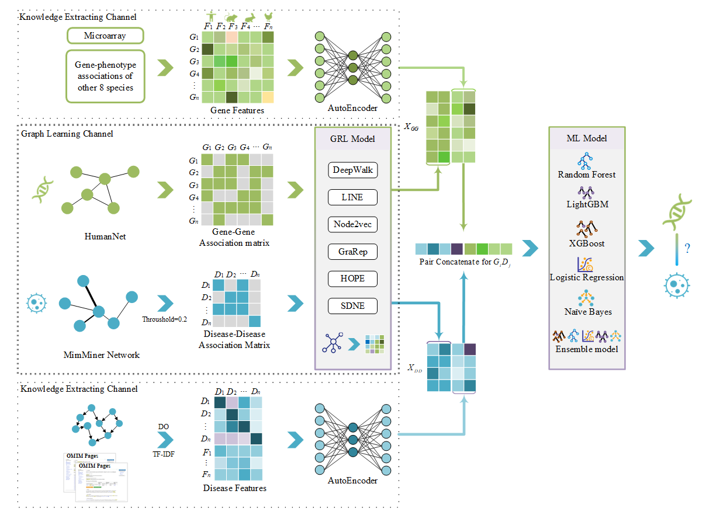

# About MGREL

this repository store the code for paper **MGREL: A multi-graph representation learning-based ensemble learning method for gene-disease association prediction**。

we first re-organized the current gene-disease association prediction benchmark by extracting the latest gene-disease associations from the OMIM database. Then, we developed a multi-graph representation learning-based ensemble model, named MGREL to predict potential gene-disease associations. MGREL integrated two channels to extract gene and disease features, including knowledge extraction channel and graph learning channel. Then ensemble machine learning methods were used as the classifier to predict the association. The workflow of MGREL model was shown in Figure.




# Data

We adopted and reorganized a gene-disease association benchmark dataset as widely used in the previous studies **[RGCN](https://github.com/liyu95/Disease_gene_prioritization_GCN/tree/af763c0ea291406da89edbe92525edb79a03c69a/data_prioritization) AND [LUPI](https://github.com/juanshu30/Disease-Gene-Prioritization-with-Privileged-Information-and-Heteroscedastic-Dropout)**, which consists of gene-disease associations, gene-gene associations, disease-disease associations, gene features, and disease features (as shown in **Table**). See more detials in the paper.

| Data              | Source                     | Num   | Edges  | Dementions |
| ----------------- | -------------------------- | ----- | ------ | ---------- |
| Association       |                            |       |        |            |
| Gene-disease      | CTD                        |       | 22054  | -          |
| Gene-Gene         | HumanNet                   | 12331 | 733836 | -          |
| Disease-Disease   | MinMiner                   | 3215  | 645945 | -          |
| Features          |                            |       |        |            |
| Gene  features    | Microarray                 | -     | -      | 4536       |
| Gene  features    | gene-phenotype association | -     | -      | 12944      |
| Disease  features | DO similarity              | -     | -      | 16592      |
| Disease  features | TF-IDF of OMIM text        | -     | -      | 16592      |

*The sum dementions of DO similarity, TF-IDF of OMIM text is 16592*


# SubFolders

* baseline：code for `HAN`, `LUPU`, `RGCN`, `PGCN`

* data：store the data updated from OMIM.
    * `dd.npz`, `gd.npz`, `gg.npz` was the **final dataset** generated by MGREL from `clinicalfeatures_tfidf.mat`，`genes_phenes.mat`，`GeneFeatures.mat` files. 
    * `EntreID.txt`, `diseaseID.txt` are the geneID and diseaseID extrated from LUPI dataset.
    * `geneDisAdj_sum.pkl` is the association prepcessed from OMIM and saved in crs spares matrix. To avoid the conflict, we match the association and ignore the non-association diseases or genes, and fill it with 0. After removing redundancy and missing data, the final version of our updated gene-disease associations contains 12,331 genes, 3,215 diseases, and 22,054 associations.See more details in the paper.

* src：主要存放论文中提到的模型方法
    * model：code for MGREL

* OpenNE：See the repository [OpenNE](https://github.com/thunlp/OpenNE). Added the running shell to make code read friendly.

* run.txt：Log for every running CMD and log date

# Code usage

1. get these 3 data files `clinicalfeatures_tfidf.mat`，`genes_phenes.mat`，`GeneFeatures.mat` from [RGCN](https://github.com/liyu95/Disease_gene_prioritization_GCN/tree/af763c0ea291406da89edbe92525edb79a03c69a/data_prioritization) OR [LUPI](https://github.com/juanshu30/Disease-Gene-Prioritization-with-Privileged-Information-and-Heteroscedastic-Dropout)

2. get [OpenNE](https://github.com/thunlp/OpenNE) environments to **the same conda env**

3. change dir to `/MGREL` and running `/src/model/main.py`
```SH
cd YOUR_PAHT/MGREL
python src/model/main.py -ah 512 64 -id 1 -md train -fo 5 -se 0 -om SDNE HOPE
```


# License
[1] MGREL: A multi-graph representation learning-based ensemble learning method for gene-disease association prediction


# Acknowledgement
To succeed in MGREL model is
This project could not be developed without the support of **collaborators [gu-yaowen](https://github.com/gu-yaowen)**
We also thank the open source OMIM database, the NCBI database and OpenNE repository.


